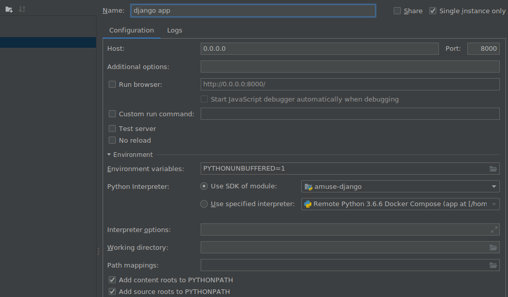

# amuse.io [](https://circleci.com/gh/amuseio/amuse-django)[](https://codecov.io/gh/amuseio/amuse-django)

## Purpose
This project is the main project within amuse and it is quite a big monolith that is currently handling several important responsibilities.

- User Account management
- Artist management
- Release management
- Release delivery management
- Store management
- Admin interface (aka Jarvi5)
- Proxy for other services

## Technical stack

In this project we currently use the following technologies:
- [Docker CE 18.09+](https://store.docker.com/search?type=edition&offering=community)
- Python v3.9 with pyproject.toml and poetry.lock
- Django v2.2 with Django REST framework
- Postgres v12.7 hosted on AWS RDS
- Redis hosted on AWS ElastiCache
- CircleCI
- AWS S3
- AWS SQS
- AWS SNS
- GCP PubSub

We also make heavy use of Makefile and make commands that everyone should be familiar with.

If you are new to this project you please follow the [setup](https://store.docker.com/search?type=edition&offering=community) instructions.


## Environments
We currently have 4 different environments where we deploy this project:
 - Development environment (on local machine used for development purposes)
 - Review environment (used for testing individual PRs optionally with QA person)
 - Staging environment (used for more extensive testing individual PRs with QA person)
 - Production environment (once everything checks out we deploy on production via CircleCI)

**Important! Currently review and staging environment share the same database!**


## DB migrations

We are using the Django framework and manage commands in order to handle db migrations.

**Important! It is highly advised that database migrations for a feature handled in a single git commit that is merged in advance.
Since the review environment shares the same database with staging,
it is best if the database modeling and update precedes the rest of the codebase.**


## Documentation

### User Account management
To be added

###Artist management
To be added

###Release management
To be added

### Release delivery management
To be added

### Store management
- **Store**: A store is a place where the music of an artist can get distributed.
- **DSP**: A DSP is the actor or business in control of a Store.

#### Adding a new store
To support a new store the following is required:
1. DSP is contacted via an Amuse manager and all business an*d* technical specifications are negotiated.
2. Support to deliver to the store is added in the [release-delivery-service](https://github.com/amuseio/release-delivery-service)
3. New channel is added on this service
4. A new record is added on release stores model and an internal_name and a store logo is set but the store is set as inactive to begin with
5. The _internal_name_ is set as a snake_case of the name of the store
6. The store logo is provided by the DSP and should be uploaded on an AWS S3 bucket: amuse-storage/store-logos/
7. Manual integration tests are made to check that DDEX insert/update/takedown are working properly.
8. The store is set to active once the team has coordinated and COPS/Support/Marketing are already informed.

### Admin interface (aka Jarvi5)
To be added

### Proxy for other services
To be added

## Setup

### Docker setup


1. Docker installation -  For this [Docker Desktop](https://www.docker.com/products/docker-desktop) can be used.

1. Add the following entry to `/etc/hosts`:

```
127.0.0.1   api-dev.amuse.io app-dev.amuse.io admin-dev.amuse.io s3-dev.amuse.io
```

2. Run `make build` to build app into Docker container.

3. Run `make setup` to bring up the project, initialize the database and
create a superuser account for you. <br/>
*Note:* if you get a "No fixture named '*' found." error, enter the containter and run `python3 manage.py loaddata */fixtures/*`.

## Running the development environment

```sh
docker-compose up -d
```

### Setup git hooks

```sh
make configure-hooks
```

This will configure git to use hooks from our [hooks directory](./.githooks).
We use hooks to for example format python code before committing staged files.

### Running tests

```sh
make docker test
make docker coverage
```

### Linting

```sh
make docker lint
```

### Automagic python code formatting with [black](https://github.com/ambv/black)

To format any modified (git status) python files

```sh
make docker black
```

To format specific files

```sh
make docker black <file1> <file2> ...
```

### Package management
We are using [Poetry](https://python-poetry.org/) for python packaging and dependency management tool.
You can add new package using command:
```sh
poetry add <package_name>@<version>
```
For more poetry commands you can check [docs](https://python-poetry.org/docs/cli/)

### Rebuilding the application image

```sh
make build
```

### S3 (minio)
Local docker environment is using `Minio` as S3 replacement.
With hosts configured as mentioned above, you can access the minio web
interface [here](http://s3-dev.amuse.io:9000/) using credentials
`minio:secret123`.

To reset and remove all local buckets, use the `reset-minio` target.
```sh
make reset-minio
```

## Debug the app and run tests in PyCharm/IntelliJ

### Setup interpreter

Note! You must configure Django in preferences before you do this (currently under change).

- Install the IntelliJ Docker plugin if you don't have it already.
- Create a new Python interpreter in the IDE using Docker Compose.
  - Select `docker-compose.yml` and service `app`.
- Select the newly created interpreter for the project

### Run the web server

- Create a `Django server` run configuration and use the host `0.0.0.0` and port `8000`.
Make sure to use the newly created interpreter.



You should now be able to run and debug the Django app right from the IDE.


### Run tests

- Open the Run configurations and expand `Templates` and edit the `Django tests` config.
- Add the `Options`:
  - `--no-input --keepdb --verbosity 2` (taken from the `test` target in the makefile)

This change will make sure that the test database is kept between runs.

After the template is saved you should be able to run and debug all the
unit/integration tests that we have in the project.

